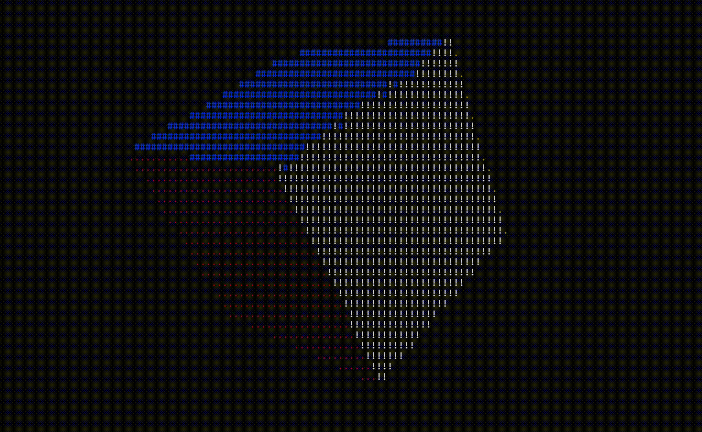

# Rotating ASCII Cube in C++



## Project Overview
This project creates a rotating 3D ASCII cube that is displayed in the terminal. The cube rotates continuously, and the luminance of its faces is shown using ASCII characters. Each face of the cube is uniquely colored with six different colors, similar to a Rubik's cube.

The rotation mechanism is inspired by Andy Sloane's [blog post](https://www.a1k0n.net/2011/07/20/donut-math.html), where he explained how the rotating ASCII donut works. This served as the inspiration for building this project.

---

## Features

### 1. **Cube Rotation**
- The cube rotates in 3D, and the rotation is displayed with ASCII art in the terminal.
- Luminance is depicted using varying ASCII characters.

### 2. **Face Coloring**
- Each face of the cube is displayed in a unique color.

### 3. **Interactive Controls**
- **Pause Rotation**: Press the `Space` key to pause the rotation.
- **Manual Rotation**:
  - **W/S**: Rotate the cube around the X-axis.
  - **A/D**: Rotate the cube around the Y-axis.
  - **Q/E**: Rotate the cube around the Z-axis.

### 4. **Light Direction Customization**
- You can customize the direction of the light by modifying the `light` array in the code.

---

## Troubleshooting

- **Distorted Cube Display**:
  - If the cube appears distorted in your terminal, maximize the terminal window to full screen or press `Ctrl + "-"` to zoom out.

- **Performance**:
  - For increased speed and smoother rotation, connect your laptop to a charger.

---

## How to Run
### Option 1: Run the Compiled Code
- Download the precompiled executable file `rotated_cube.exe` from the repository.
- Double-click the executable to run it directly on your system.

### Option 2: Compile the Code Yourself


1. Clone the repository:
   ```bash
   git clone https://github.com/aniketmishr/ascii-rotating-shapes.git
   ```
2. Navigate to the project directory:
   ```bash
   cd ascii-rotating-shapes
   ```
3. Compile the code:
   ```bash
   g++ rotating_cube.cpp -o rotating_cube
   ```
4. Run the program:
   ```bash
   ./rotating_cube
   ```

---

## Acknowledgments
This project was inspired by Andy Sloane's blog post on the rotating ASCII donut. His explanation motivated me to explore ASCII rendering and create a similar project with a unique spin.

---

## License
This project is licensed under the MIT License. See the `LICENSE` file for details.

